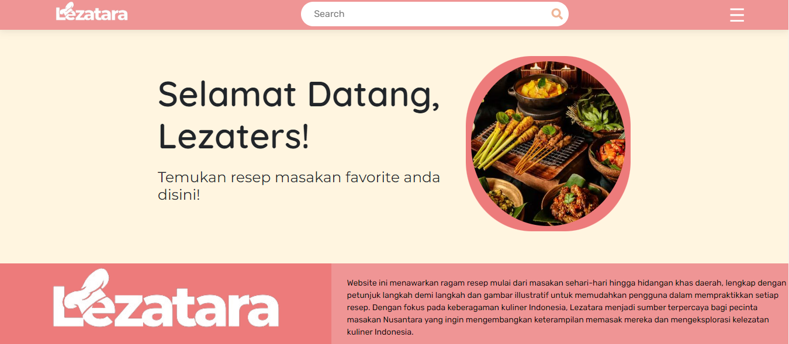

<h1 align="center">  Lezatara </h1>

 

  
Lezatara adalah sebuah platform daring (website) yang bertujuan untuk memperkenalkan, melestarikan, dan membagikan kelezatan masakan Nusantara. Aplikasi ini dirancang untuk memberikan informasi yang lengkap dan mudah diakses seputar resep-resep masakan Indonesia, termasuk bahan-bahan, langkah-langkah, dan informasi tambahan mengenai resep makanan di setiap regional wilayah indonesia, dalam website ini kami membagi ke 6 regional besar di wilayah indonesia diantaranya, Sumatera, Jawa, Bali Nusra, Kalimantan, Sulawesi, dan terakhir Papua Maluku.

<h2 align="center"> Executive Summary </h2>

  Pada era globalisasi seperti sekarang ini, masakan Nusantara semakin tidak populer dan kalah oleh pengaruh masakan luar yang berasal dari Negara lain. Di Indonesia masih banyak masyarakat lokal justru kurang mengenal dan tidak menyukai masakan tradisional Indonesia. Oleh karena itu diperlukan penyedia informasi guna memperluas pengenalan dan wawasan akan masakan Nusantara kepada masyarakat sehingga masakan Nusantara akan menjadi lebih dikenal.

<h2 align="center">Live Demo </h2>

<a href="https://google.com" text-align="center">Live Demo Link</a>

<h2 align="center"> Dokumentasi API & Git Back-End </h2>

 
  Untuk Dokumentasi API dan Git Back-End dari Aplikasi Lezatara ini bisa akses link berikut:  
 
 
   <table>
    <tr>
      <th> API </th>
      <th> Github Back-end </th>
    </tr>
    <tr>
     <td> https://lezatara-backend.vercel.app/   </td>
     <td> https://github.com/Lezatara/lezatara-backend   </td>
    </tr>
  </table>
       
  
 
 

<h2 align="center"> Project </h2>

  <table>
    <tr>
      <th> ID CAPSTONE </th>
      <th> TEMA </th>
      <th> JUDUL </th>
    </tr>
    <tr>
     <td>  C523-PS068 </td>
     <td>  Teknologi dalam Berbagai Aspek Kehidupan </td>
     <td>  Lezatara </td>
    </tr>
  </table>

 

<h2 align="center"> Features </h2>

  WEB Manifest || PWA 

 

<h2 align="center"> Deploy & Database </h2>

  <table>
    <tr>
      <th> Deploy </th>
      <th> Database </th>
    </tr>
    <tr>
     <td>   Netlify || Vercel   </td>
     <td>  PostgreSQL  </td>
    </tr>
  </table>

                  

## 👥 Authors 

👤 **Syahrul Amri**

- LinkedIn: [Syahrulamri](https://www.linkedin.com/in/syahrul-amri-1b8338197/)
- Github: [@syahrulamri11](https://github.com/syahrulamri11)
- Instagram: [@syahrul11_amri](https://www.instagram.com/syahrul11_amri/)

👤 **Fadia Indah Sari**

- LinkedIn: [FadiaIns](https://www.linkedin.com/in/fadia-indah-sari-23007427a)
- Github: [@syfaacanzz](https://github.com/syfaacanzz)
- Instagram: [@insfdiaaa____](https://www.instagram.com/insfdiaaa____/)

👤 **Haida Khoirurrosyid**

- LinkedIn: [HaidaKhoirurrosyid](https://www.linkedin.com/in/haidakhoirurrosyid/)
- Github: [@ocid13](https://github.com/ocid13)
- Instagram: [@hhayycidd__](https://www.instagram.com/hhayycidd__/)

👤 **Rizky Agung**

- LinkedIn: [Rizky](https://www.linkedin.com/in/rizky-agung-a2946a288)
- Github: [@RizkyAgung26](https://github.com/RizkyAgung26)
- Instagram: [@riiizky_agung](https://www.instagram.com/riiizky_agung/)

👤 **Andhika Trisna Putra**

- LinkedIn: [Andhika](https://www.linkedin.com/in/andhika-trisna-645523194/)
- Github: [@Andhikatp30](https://github.com/Andhikatp30)
- Instagram: [@andhika30_](https://www.instagram.com/andhika30_/)

## Bahasa Pemrograman dan Tools

[][webdev]
[][webdev]
[][webdev]
[][webdev]
[][webdev]
[][webdev]
[][webdev]
[][webdev]
[][webdev]
[][webdev]

[][webdev]

[][webdev]

[][webdev]
 
 

[webdev]: https://github.com/Lezatara/Lezatara
